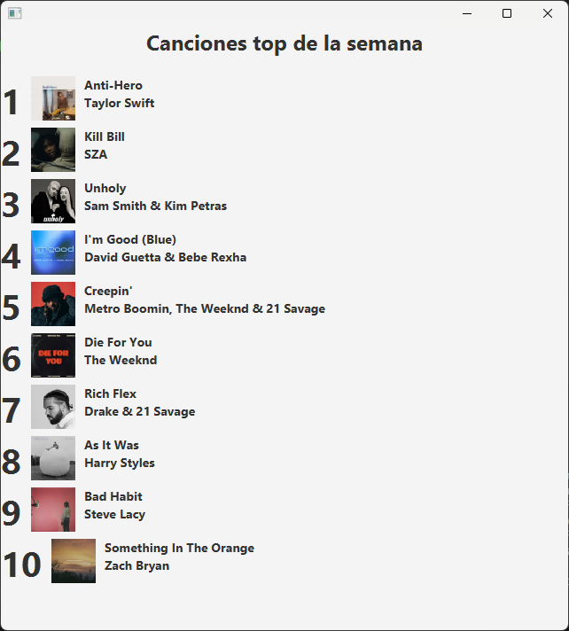
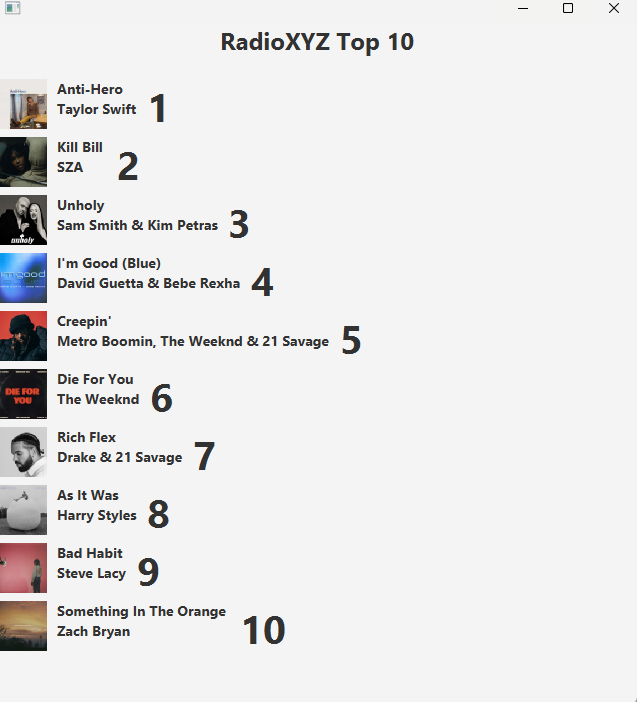

# Taller02-Ramas
## Cambios del Integrante - Artista primero luego el titulo 

Ahora se muestra el nombre del artista antes del título de la canción.

Lider:

Integrante 1 (cambios) : 

Integrante 3:

